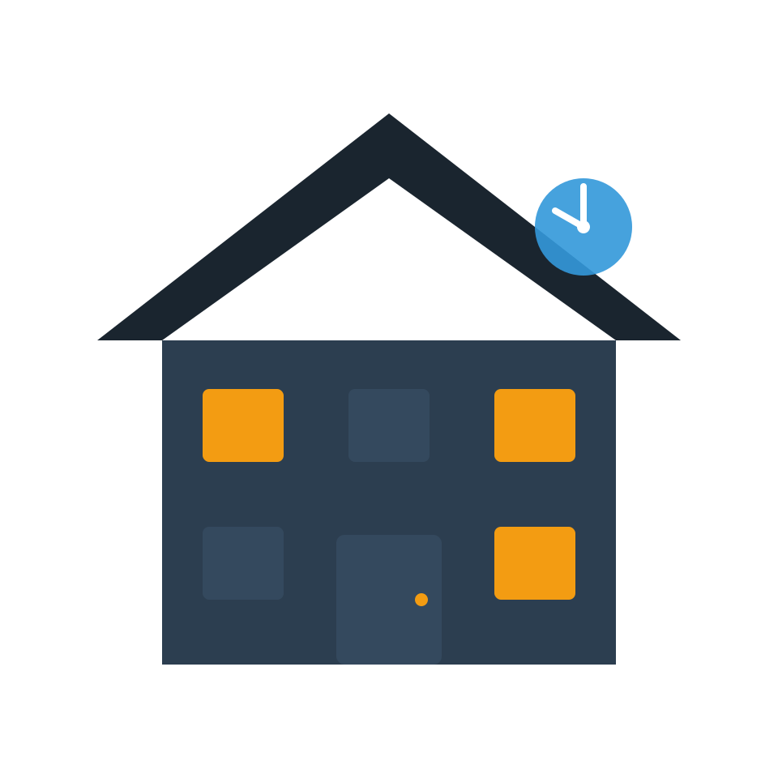
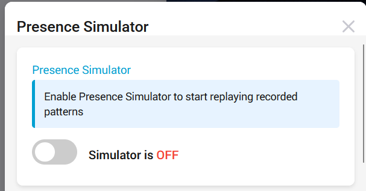
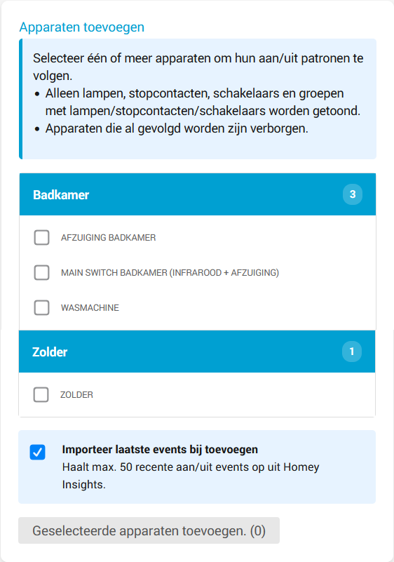
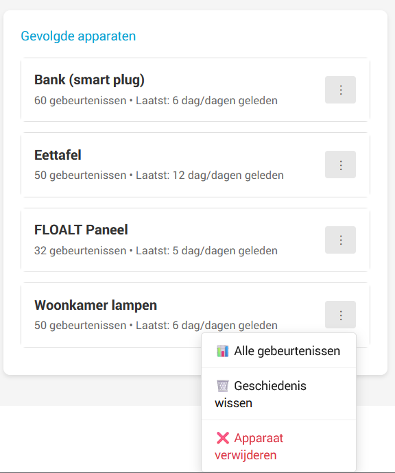
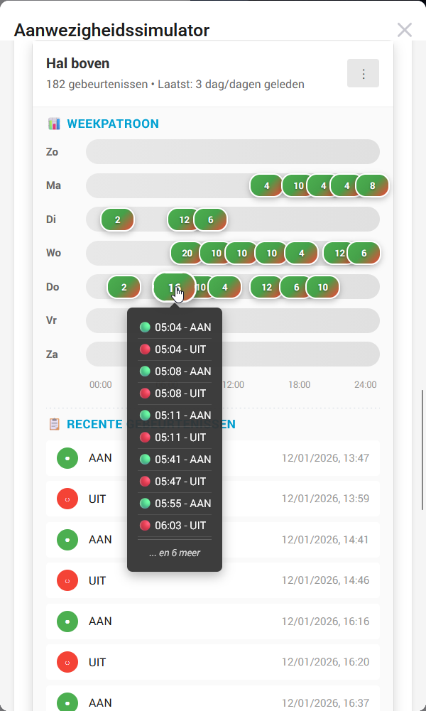

# Presence Simulator for Homey

  

  <strong>Simulate presence by automatically replaying your lighting patterns from exactly one week ago</strong>

---

## 🏠 What does it do?

Presence Simulator replays your lighting patterns from one week ago. The app automatically tracks when your lights turn on and off throughout the week, then replays these exact patterns when you enable simulation mode.

**Example:** If your living room light turned on last Monday at 19:30 and off at 23:15, it will do the same this Monday when simulation is active.

---

## ✨ Features

- **📊 Automatic tracking** - Records your lighting patterns without manual intervention
- **🔄 Week-based replay** - Replays patterns from exactly one week ago (same day, same time)
- **📈 Visual timeline** - See your weekly lighting patterns at a glance per day
- **📝 Event history** - Review when each device was turned on/off with detailed timestamps
- **🎛️ Simple controls** - Enable/disable simulation mode with one click
- **💡 Smart filtering** - Automatically filters to show only lights, sockets, and compatible groups
- **👥 Group support** - Track device groups and automatically handle individual devices
- **🔌 Multi-channel support** - Full support for devices with multiple outputs (e.g., Fibaro Walli switches)
- **📥 Import history** - Import up to 50 historical events from Homey Insights when adding devices
- **⚡ Performance optimized** - Minimal storage writes and efficient memory usage to protect your Homey

---

## 🚀 Getting Started

### Installation

1. Install the app from the Homey App Store
2. Open the app settings page
3. Select the devices you want to track
4. Build up pattern history:
   - **Quick start**: Import existing history from Homey Insights (up to 50 events per device)
   - **Automatic**: Let the app run for at least a week to record your natural patterns

### Usage

1. **Track your patterns** - The app automatically records when your selected devices turn on/off
2. **Review the timeline** - Check the visual timeline to see your weekly patterns
3. **Enable simulation** - When desired, enable "Simulation Mode" in the app settings or use a flow card to enable or disable the simulation mode.
4. **Automatic replay** - Your devices will turn on/off automatically based on patterns from one week ago

---

## ⚙️ Configuration

### App Settings

- **Simulation Mode** - Toggle to enable/disable pattern replay

  
- **Device selection** - Select which devices should replay on/off patterns when simulation mode is enabled. You can use the import function to import a maximum of 50 events.

  
- **Tracked devices** - View the devices that are being tracked. You can view week patterns with detailed on/off events, import history, remove the history and remove the device:

  
- **Timeline view** - Visualize patterns per day of the week (Monday - Sunday). You can even click on a badge to view all events for that moment.

  
- **Recent events** - View detailed on/off events with timestamps for recent events.

### Requirements

- Homey (Pro) firmware >= 5.0.0
- At least one compatible light, socket or switch device
- Minimum one week of tracking data for accurate simulation (or use Import feature)

---

## 🔧 How It Works

### Tracking Phase
1. The app monitors state changes of selected devices
2. Every time a device turns on or off, the event is recorded with a timestamp
3. Data is stored locally on your Homey

### Simulation Phase
1. When simulation mode is enabled, tracked lights will be set to the same state exactly one week ago.
2. It schedules the same actions for today (e.g., if the device turned on last Monday at 19:30, it will turn on this Monday at 19:30)
3. The simulation runs continuously until you disable it

---

## 🛠️ Troubleshooting

### Devices aren't turning on/off during simulation

- Ensure simulation mode is enabled in the app settings
- Verify the device has at least one week of tracking data
- Check if the device is still online and responding
- Review the event history to confirm events were recorded

### Timeline shows no data

- Wait at least 24 hours after adding a device for data to appear
- Manually toggle the device on/off a few times to generate events
- Check if the device is properly added in the tracked devices list

### Device not available for tracking

- Only lights, sockets, and groups containing lights/sockets are shown
- Ensure the device supports on/off capability
- Verify the device is online and working normally in Homey
- If a device is part of a tracked group, it won't appear individually

---

## 🔐 Privacy & Permissions

### Required Permission: `homey:manager:api`

This app requires access to the Homey API to function. Here's exactly what we use it for:

| Usage | Location | Purpose |
|-------|----------|---------|
| `api.devices.getDevices()` | [api.js:82](api.js#L82), [api.js:298](api.js#L298) | List available devices for selection and display names |
| `api.devices.getDevice()` | [app.js:271](app.js#L271), [app.js:725](app.js#L725), [app.js:792](app.js#L792) | Read current device state |
| `api.zones.getZones()` | [api.js:83](api.js#L83) | Display zone names in device selector |
| `device.setCapabilityValue()` | [app.js:734](app.js#L734), [app.js:796](app.js#L796) | Turn devices on/off (**only when simulation is enabled**) |
| `api.insights.getLogs()` | [api.js:434](api.js#L434) | Import historical data (optional, user-initiated) |

### What we DON'T do:
- ❌ No data leaves your Homey - everything is stored locally
- ❌ No cloud connections or external servers
- ❌ No analytics or tracking of your usage
- ❌ No access to other apps or personal data

---

## 📝 License

This project is licensed under the GPL-3.0 License - see the [LICENSE](LICENSE) file for details.

---

## 🐛 Bug Reports & Feature Requests

Found a bug or have a feature request? Please open an issue on GitHub:
https://github.com/anoniemnd/homey-presence-simulator/issues

---

## 👤 Author

**Anoniemand**
- GitHub: [@anoniemnd](https://github.com/anoniemnd)
- Email: github@anoniemand.com

---

## 🙏 Acknowledgments

- Thanks to the Homey community for feedback and testing
- Built with ❤️ for Homey

---

## 📋 Changelog

### Version 1.0.4
- **Added**: Full support for all 10 languages across all app components (flow cards, name, description)

### Version 1.0.3
- **Fixed**: "Last activity" indicator showed oldest event instead of most recent event
- **Fixed**: Singular/plural forms now display correctly (e.g., "1 day ago" instead of "1 day/days ago")
- **Fixed**: Tuned light background greys so that dark mode inversion yields a softer dark grey instead of harsh pure black.

### Version 1.0.2
- **Added**: Multi-channel device support (e.g., Fibaro Walli switches with multiple outputs)
- **Fixed**: Reduced storage writes to protect eMMC lifespan (per-device storage instead of saving all devices)
- **Fixed**: Optimized memory usage by reusing single HomeyAPI instance instead of recreating multiple times
- **Fixed**: Optimized polling interval (5s → 5 min)
- **Fixed**: Prevent duplicate event recording from listener

### Version 1.0.1
- Added community topic

### Version 1.0.0
- First version!

---

  Made with ☕ and 💡

